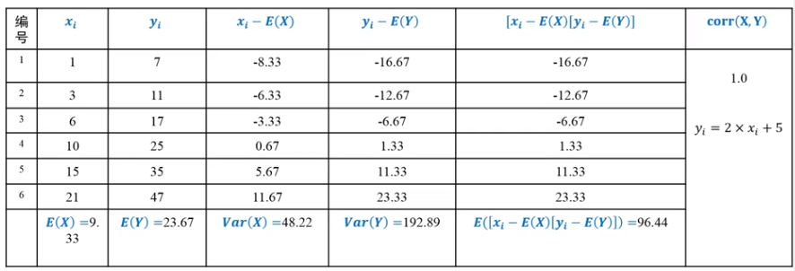

# 主成分分析PCA

**Principle Component Analysis** is popular, famous

是一种**特征降维方法**：
把高维数据投影到低维空间。

> 奥卡姆剃刀：如无必要，勿增实体

降维的结果要保持**原有结构**

- 图像数据：视觉对象区域构成的空间分布

- 文本数据：单词之间的（共现）相似或不相似

  *关于共现：https://blog.csdn.net/tian_panda/article/details/81127034*

## 1. 有关统计的术语

1. **方差**，一维的
   $n$ 个数据：$X=\{x_1,...x_n\}$$var(X)=1/n\sum_{i=1}^n (x_i-u)^2$(u是样本均值)

2. **协方差**，定义在n维数据上的
   衡量俩变量之间的相关度
   以二维为例：
   $n$ 个2维变量数据：$(X,Y)=\{(x_i, y_i),...,(x_n,y_n)\}$
   $cov(X,Y)=1/n\sum_{i=1}^n (x_i-\bar x)(y_i-\bar y)$
   **判断相关性：**
   1. 当cov>0，正相关；
   2. 当cov<0，负相关；
   3. 当cov=0，不相关（线性）

## 2. pearson相关系数

**Pearson相关系数**可以把两组变量之间的关联度（协方差可以算出）规整到一定的取值范围内。$[-1,1]$
$$
corr(X,Y)=\frac{cov(X,Y)}{\sqrt{Var(X)Var(Y)}}=\frac{cov(X,Y)}{\sigma_x\sigma_y}
$$
例子：

> 上图的**相关系数**是1，这表示相关性很强。

#### 1. Pearson相关系数的性质

1. $|corr(X,Y)|\leq1$
2. $corr(X,Y)=1\Leftrightarrow\exist a,b\quad Y=aX+b$
3. $corr(X,Y)=corr(Y,X)$
4. $|corr(X,Y)|$越大，说明二者的相关程度越大，=0，那么不存在线性相关的关系.
5. 正线性相关：X增$\rightarrow$Y增

#### 2. 相关性与独立性

- X和Y线性不相关，则$corr(X,Y)=0$
- X和Y独立，一定$corr(X,Y)=0$，而且X和Y啥关系都没有
- **不相关比独立要弱**，独立一定不相关，但是不相关不一定独立（可能有其他的复杂关系）

## 3. 算法动机

保持结构不变（去除冗余性），就是要把方差小的方向忽略掉，**尽量向方差最大的方向投影**。

> 如图所示，投影完之后，每个样本点尽量彼此离散。

- 要将 $n$ 维投影到 $l$ 维，先向方差最大的维度投影
- 然后向方差第二的维度投影……

## 4. 算法描述

### 1. 理论介绍

#### **条件**

有 $n$ 个 $d$ 维的样本数据，$D=\{x_1,...,x_n\}，x_i\in R^d$ 。 $D$ 可以表示成一个 $n\times d$ 的矩阵 $\bf X $ 。

> 假定每一维度的特征均值都是0（已经标准化）。

#### 目的

是求取且使用一个 $d\times l$ 的映射矩阵 $\bf W$ 。有了这个矩阵，就能把**给定的 $d$ 维的 $x$ 映射到 $l$ 维空间**。

降维后的数据用 $n\times l$  的矩阵 $\bf Y$ 表示，$\bf Y=\bf X \bf W$。

#### Y的方差和正交性

1. 我们希望降维以后方差最大，所以就计算方差。

   > 第一行式子在最后有解释。 

   $$
   var(\textbf Y)=\frac{1}{n-1}trace(\textbf Y^T\textbf Y)
   =\frac{1}{n-1}trace(\textbf W^T\textbf X^T\textbf X\textbf W)
   =trace(\textbf W^T\frac{1}{n-1}\textbf X^T\textbf X\textbf W)
   $$

   降维之前的矩阵 $\bf X$ 的协方差矩阵$\Sigma=\frac{1}{n-1}\bf X^TX$：
   
   那么代入上式可得$var(\textbf Y)=trace(\textbf W^T\Sigma \textbf W)$
   
   而我们希望找到一个矩阵 $\textbf W$，使得 $trace(\textbf W^T\Sigma \textbf W)$ 最大。
   
2. 同时，还要一个条件，就是 $\textbf W$ 需要满足：对于 $\textbf W$ 中的任意一列 $\textbf w_i$ ，都有$\textbf w_i^T\textbf w_i=1$ ，这是为了让所得到的的映射结果相关性更小（**正交性**），因为两个维度相关性大的话就意味着这二者存在冗余。

#### 拉格朗日函数

又要方差大，又要相关性小。
$$
L(W,\lambda)=trace(W^T\Sigma W)-\sum_{i=1}^l\lambda_i(w_i^Tw_i-1)
$$
$\lambda_i$ 是拉格朗日乘子

对上述函数中的$w_i$求偏导，并且令导数为0，得：
$$
\Sigma w_i=\lambda_i w_i
$$
为什么一个矩阵乘以一个向量等于一个常数乘以一个向量呢？这说明了： $w_i$ 是 $\Sigma$ 的一个特征向量，而 $\lambda_i$ 是这个特征向量对应的特征值。

### 2. 算法实现

##### 1. 算法的输入和输出

- input：X, l
- output：W={w_1,...,w_l}

##### 2. 算法步骤

1. 中心化处理，把平均值搞成0
2. 计算$\Sigma=1/(n-1)X^TX$
3. 对$\Sigma$进行特征值分解，将其特征根 $\lambda$ 按照从大到小排序，有d个
4. 取前 $l$ 个最大的特征根 $\lambda$ 对应的特征向量 $w$ ，组成映射矩阵 $\bf W$
5. 把每个样本数据 $x$ 都用 $\bf W$ 来降维 

> **关于公式第一行的解释**
>
> Y的转置乘以Y，结果中把对角线的元素取出来，结果就是矩阵Y​的方差。
>
> 原因：已经标准化了，均值就是0。
>
> 假设Y是下式，也就是说，有3个样本数据，每个数据4维
> $$
> \left[
>  \begin{matrix}
>    1 & 2 & 3&4 \\
>    4 & 5 & 6&6 \\
>    7 & 8 & 9&6
>   \end{matrix}
>   \right]
> $$
> Y^T^：
> $$
> \left[
>  \begin{matrix}
>    1 & 4 & 7 \\
>    2&5&8\\
>    3&6&9 \\
>    4&6&6
>   \end{matrix}
>   \right]
> $$
> Y^T^Y出来的结果是一个3x3的矩阵
> $$
> \left[
>  \begin{matrix}
>    o & . & . \\
>    .&o&.\\
>    .&.&o
>   \end{matrix}
>   \right]
> $$
> 那么左上角就是Y第一列的平方和，也就是此时数据第一维度的方差。