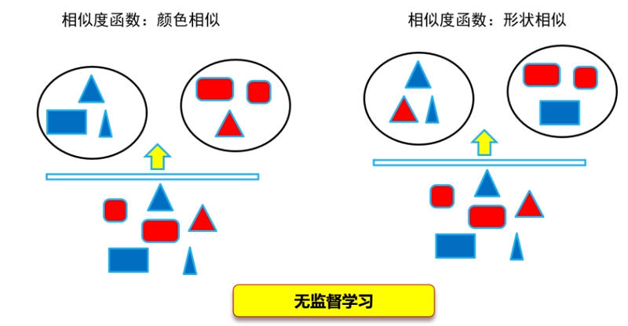

# 无监督学习

**无监督学习：** 没有语义标签，聚类成团结果（不同聚类间隔较远）。

**无监督学习的重要因素：**

- 数据特征
- 相似度函数，基于所提取的特征计算数据之间的相似性

*相似度函数不同，聚类方式不同。*

# K均值聚类(K-means聚类)

- input：n个数据
- output：k个聚类结果
- 目的：将n个数据聚类到k个集合（**类簇**）

## 1. 算法：

概念定义：

- n个m维向量：$\{x_1,x_2,...,x_n\},x_i\in R^m(1\leq i\leq n)$
- 两个m维数据 $x_i,x_j$ 之间的欧氏距离为：$d=\sqrt{\sum_{k=1}^m(x_{ik}-x_{jk})^2}$（其实就是二维平面两点距离的推广。）
  $d$ 越小，表示二者越相似。
- 聚类集合数目k

##### 1. 初始化聚类质心

- 因为要分成k个不同的集合，所以需要k个质心。$c=\{c_1,c_2,...,c_k\},c_j\in R^m(1\leq j\leq k)$
- 质心 $c_j$ 所在的集合是 $G_j$

##### 2. 把每个待聚类的数据放入唯一一个聚类集合中

- 计算 $x_i$ 和 $c_j$ 之间的 $d$
- 把 $x_j$ 放进最近的 $G_j$ 中。

##### 3. 根据聚类结果，更新聚类质心

- 对于k个类簇中的一个，把里面的所有元素加起来除以个数，得到新的质心。$c_j=\frac{1}{|G_j|}\sum_{x_i\in G_j} x_j$

##### 4. 按照新的质心继续聚类，算法迭代，直到满足条件

满足下面的条件中的一个，聚类停止。

- 已经达到了迭代次数上限（强制退出）
- 前后两次迭代中，聚类质心基本保持不变（结果已经不错了，认为它已经收敛了）

## 2. 本算法另一个视角：最小化每个类簇的方差

对于第 $i$ 个类簇，其方差为$var(G_i)=\frac{1}{|G_i|}\sum _{x\in G_i}[(x_1-c_i)^2+(x_2-c_j)^2+...+(x_n-c_i)^2]$

## 3. 算法不足

1. 需要事先指定k，但我们可能并不知道
2. 需要初始化聚类质心，这对结果有较大影响
3. 迭代执行，时间开销大
4. 欧氏距离内含的假设是：每个维度一样重要。但是现实中，每个因素的权重是不一样的。
