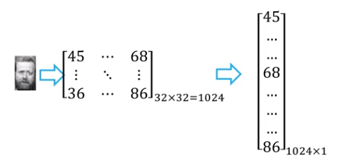
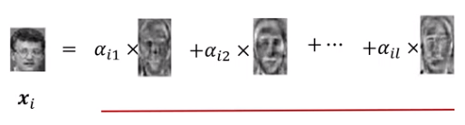

# 特征人脸算法

用**主成分分析**给人脸图像降维。

本质是用一种称为"**特征人脸(eigenface)**"的特征向量按照线性组合形式来表达每一张原始人脸图像，进而实现人脸识别。

> 下面的内容不严谨，是我自己理解的。
>
> 假设特征向量 $x_1,...x_n$
> 原始人脸图像是 $y_1,...y_n$
>
> 那么对于第 $j$ 张脸 $y_j$，有
> $y_j=a_{j1}x_1+...+a_{jn}x_n$

关键在于得到**特征人脸**。

## 算法描述

对于一张图片，可以用一个矩阵来描述。

比如一个32*32的图可以用32\*32的矩阵来描述，我们把它转换成1024\*1列向量，也就是1024维。

- input：n个1024维的人脸样本数据构成的矩阵 $\bf X$ (n*1024),降维后的维数 $l$

- output：映射矩阵 $\textbf W=\{\textbf w_1,...\textbf w_l\}$ (1024*l)，其中每一个w都是一个特征人脸

  > 大概把人长得像的部分删掉了？？

## 算法步骤

1. 现在我们有很多1024*1的向量 $x_i$ ，对它们中心化处理
2. 计算协方差矩阵
3. 特征值分级，然后从大到小排序
4. 选前 $l$ 个最大的特征根对应的特征向量 $\textbf w_1,...\textbf w_l$ 组成映射矩阵 $\bf W$
5. 将每个人的人脸降维，从1024维变成 $l$ 维
6. 把 $\textbf w_1,...\textbf w_l$ 还原成32*32，被称为特征人脸。所以得到 $l$ 个特征人脸。

##  基于特征人脸的降维

- 将每个人脸分别与 $l$ 个特征人脸做矩阵乘法，得到1个相关系数(1*1)
- 每个人脸得到 $l$ 个相关系数，也就是每个人脸从1024维变成 $l$ 维。

- 每个人脸都是所有特征人脸的线性组合，也就是，**实现了人脸从“像素点表达”到“特征人脸”表达的转变**。原来是1024维（1024个像素点），现在是 $l$ 维（保存 $l$ 个特征人脸各自的系数就可以了）。
  
- 这样，想要计算俩人脸是不是相似，就不用计算1024个像素了，计算 $l$个系数就可以了。

## 人脸表达的方法对比

### 聚类

把一堆人脸图像处理成k堆聚类，然后计算要判断的那张脸和哪个聚类的质心最相似。

### 主成分分析

### 非负矩阵人脸分解方法

和主成分分析一样，都会产生特征人脸。

但在这里， 得到特征人脸之后，表示某一张人脸的时候，不是每一个特征人脸都要参与线性组合重建。**“部分组成整体”**

